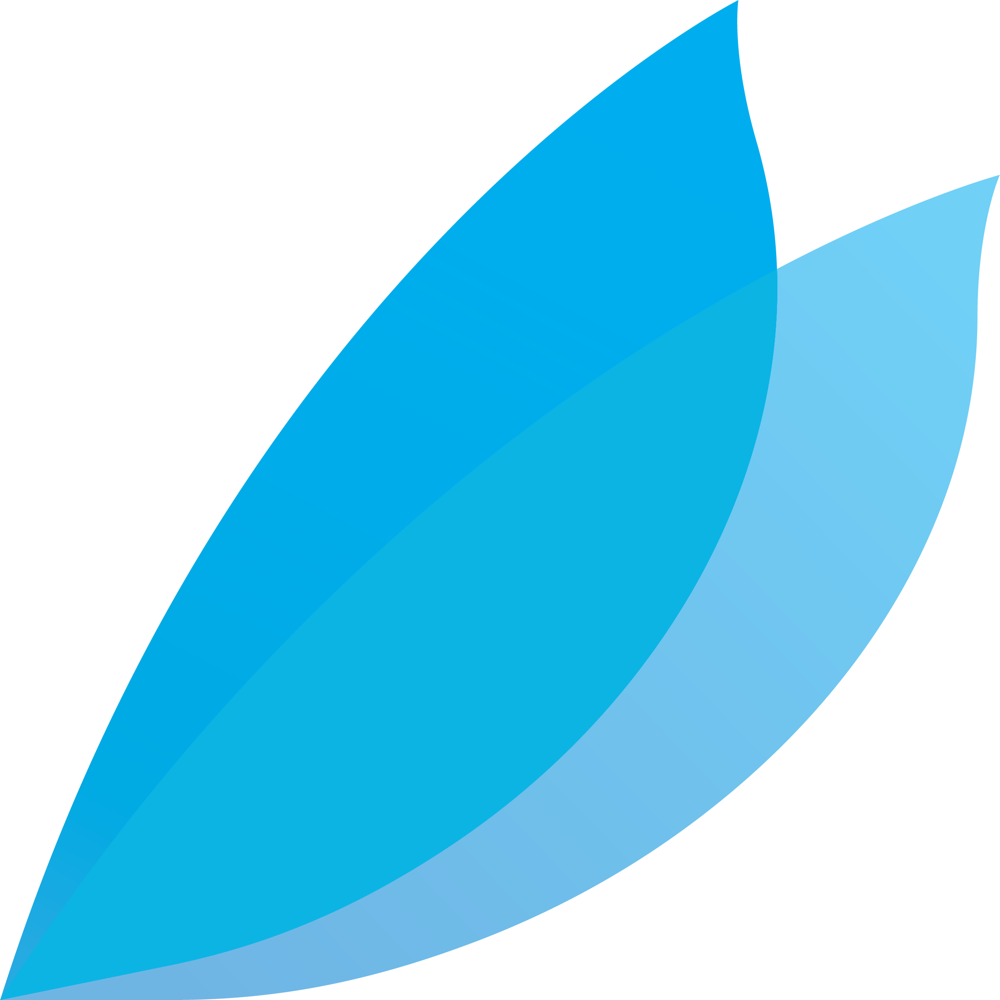
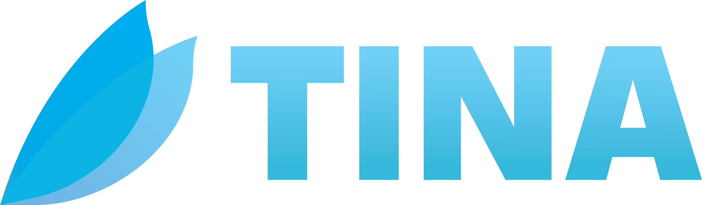
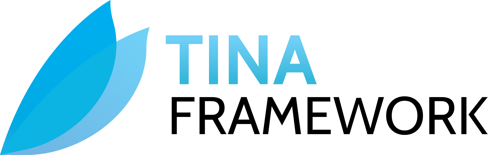
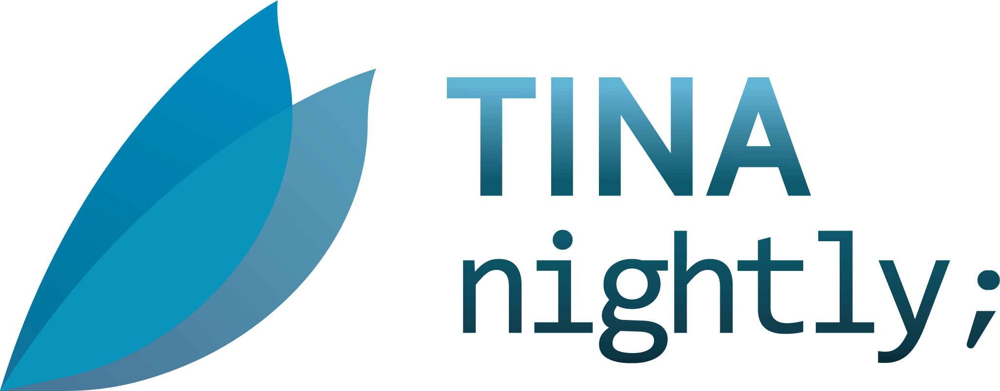

# Branding Guidelines

Tina is first and foremost an open source project, and as such, we want to make sure that the project is as accessible as possible to everyone. This includes recognisable and popular branding that encourages people to use the project, and contribute to it.

Although it is **not required** to use any Tina branding, we do encourage at least a mention ot it

## "Tina"

Tina (*/tina/*) stands for "Tina is not Aero".

You are allowed to use the name "Tina" in your own projects as long as they USE, IMPLEMENT, COMPLIMENT, or EXTEND the official Tina repository; please do not use the name "Tina" in a way that could be confused with the official Tina project.

## "Tina Framework"

"Tina Framework" is a phrase that refers specifically to this GitHub repository.

You are encouraged to use this over "Tina" in your own projects, as it is more specific and less likely to be confused with the female name *Tina*.

## Icon

The Icon is a pair of blue wings, assumedly those of a fairy named Tina.

You are allowed to use the icon in your own projects as long as they USE, IMPLEMENT, COMPLIMENT, or EXTEND the official Tina repository; please do not alter the icon in any way, and keep it to its original aspect ratio whenever displaying it.

###### File Reference: [IconBranding.png](IconBranding.png)

---

## Banner

The Banner features the Icon and has the name "Tina" written in the same font that is used by the official Aether Interactive Ltd. branding.

You are allowed to use the banner in your own projects as long as they USE, IMPLEMENT, COMPLIMENT, or EXTEND the official Tina repository; please do not alter the banner in any way, and keep it to its original aspect ratio whenever displaying it.

###### File Reference: [BannerBranding.png](BannerBranding.png)

---

## In-Game

The In-Game Banner features the Icon and the "Tina Framework" phrase written in the same font that is used by the official Aether Interactive Ltd. branding.

This banner is hard to use on Dark Backgrounds, so we recommend using the Banner instead.

You are allowed **and encouraged** to use the in-game banner in your games or experiences as long as they USE the Tina Framework; please do not alter the in-game banner in any way, and keep it to its original aspect ratio whenever displaying it.

###### File Reference: [IngameBranding.png](IngameBranding.png)

---

## Nightly

The Nightly Banner features the Icon and has the name "Tina" written in the same font that is used by the official Aether Interactive Ltd. branding.

If you are using Nightly, please use this banner.

You are allowed to use the nightly banner in your own projects as long as they USE, IMPLEMENT, COMPLIMENT, or EXTEND the official Tina repository; please do not alter the nightly banner in any way, and keep it to its original aspect ratio whenever displaying it.

###### File Reference: [NightlyBranding.png](NightlyBranding.png)

---

## "Aether Interactive Ltd."

"Aether Interactive Ltd." is the name of the company that owns the Tina project.

You are **not** allowed to utilize the Aether Interactive Ltd. name even in reference to the Tina project, as it is a registered trademark. Please only refer to "Tina" or "Tina Framework" in your own projects.

---

*All branding designed by Luna.* 

:copyright: 2022 Aether Interactive Ltd. All rights reserved.